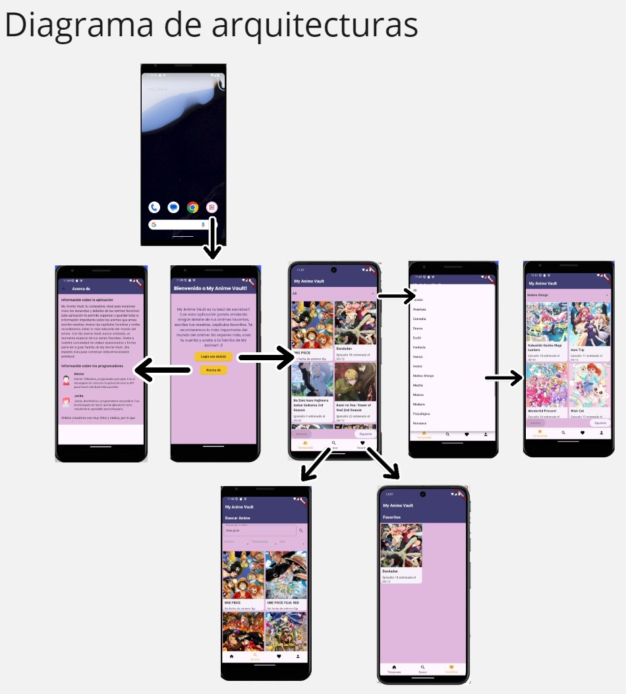
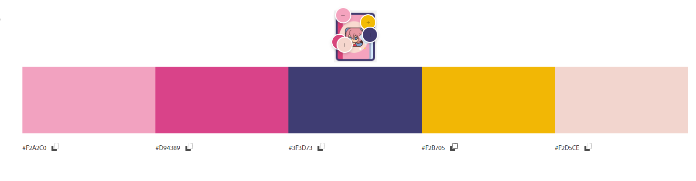

# my_anime_vault
Aplicación desarrollada por Javiera Baeza y Héctor Villalobos

## ¿En qué consiste?

La aplicación busca entregar un tracker para fanáticos de anime, para visualizar series de anime y manga, permitiendo crear una lista personalizada en donde pueda registrar su progreso, fechas de estreno e información.

## Instalación

Para instalar y ejecutar este proyecto localmente:

[Descargar APK](https://github.com/RigxorZero/my_anime_vault/raw/main/MyAnimeVault.apk)

## Funcionalidades claves 

- **Autenticación con AniList**: Inicia sesión de manera segura con tu cuenta de AniList para obtener información personalizada.
- **Lista de Animes en Emisión**: Obtén detalles sobre los animes más populares en emisión.
- **Gestión de Animes Favoritos**: Guarda tus animes favoritos y lleva un registro de los episodios que has visto.
- **Interfaz amigable**: Diseño limpio y sencillo con colores suaves y un enfoque en la experiencia del usuario.

## Principales Características 

- **Inicio de sesión con AniList**: Permite a los usuarios autenticar su cuenta de AniList mediante OAuth para acceder a información personalizada.
- **Lista de Animes en Emisión**: Muestra una lista de animes que están actualmente en emisión, con detalles como:
  - Título en diferentes idiomas (romaji, inglés, nativo).
  - Imagen de portada.
  - Número de episodios.
  - Fecha de inicio y fin de la temporada.
  - Descripción y géneros.

## Diagrama de Arquitectura

## Paleta de Colores Utilizada

